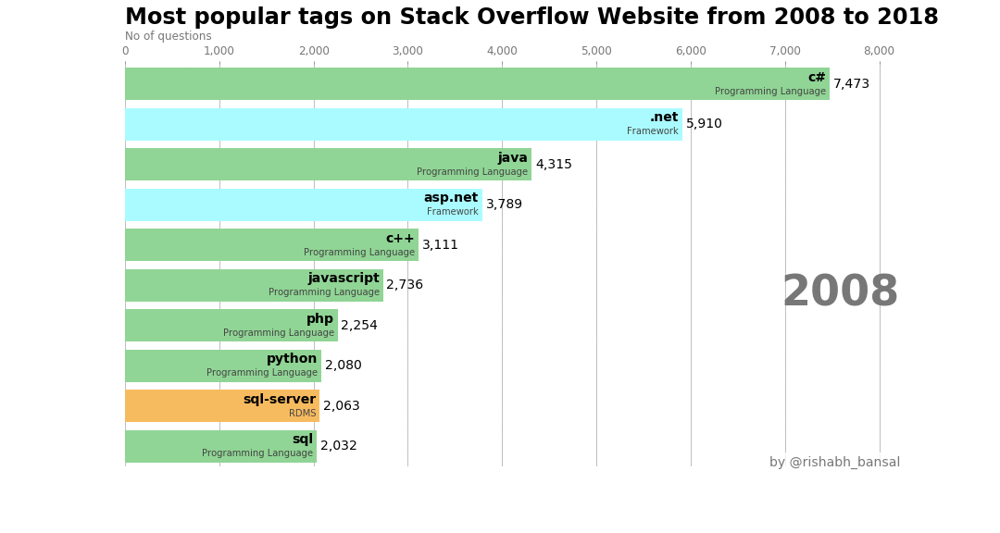

# Analysis on the Programming Languages

Data Set's observations belongs to a [Stack Overflow](https://stackoverflow.com/) tag corresponding to each year. A tag is used to place the question under a category and it can be language name (Like Python , R , C# etc) or it can go more deep to represent the libraries (numpy,pandas,...) of a programming language. The dataset also includes both the number of questions asked in that tag in that year, and the total number of questions asked in that year.Also , Racing Bar Chart was created to drive the point home.

Steps followed to do the analysis are as follows:-

- Importing the required libraries 

- Loading and inspecting the dataset.

- Adding fraction (no of question belonging to a tag / no of total questions) column to the dataset.

- Creating a dataframe containing the python and R tags to see both the language's growth over time and visualizing the same using the line plot.
  
- Similar work was done to know which of the python libraries are more common (More the fraction of questions for a tag , the better it is)
amongst the users in the field of Data Science.  
        a) Comparison among the data processing/manipulation libraries.   
        b) Comparison among the Natural Language Processing Libraries.  
        c) Comparison among the Machine Learning and Deep Learning Libraries.  
        d) Comparison among the Data Visualization Libraries.  

- More analysis was done to know what are the most common tags i.e. tags have the most no of questions.  

- Also checked which languages are dying and what are the emerging ones.

- Lastly analyzed how the three big mobile operating systems (Android, iOS, and Windows Phone) fare in popularity over time.

#### For detailed analysis , please check the full [notebook](https://github.com/RishabhBansal2409/Programming_Languages_Analysis/blob/master/Programming_languages_Analysis_in_Python.ipynb).
